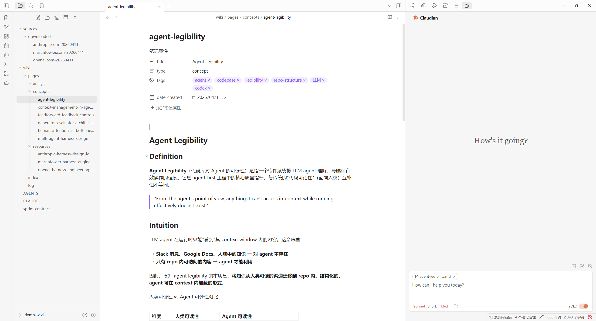

# llm-wiki

[中文说明](README.zh-CN.md)

- [Design Philosophy](#design-philosophy)
- [What You Get](#what-you-get)
- [Quick Start](#quick-start)
- [Ideal Setup](#ideal-setup)
- [Using llm-wiki](#using-llm-wiki)
- [Roadmap](#roadmap)

`llm-wiki` is a local CLI for building an Obsidian-based knowledge workspace for both human use and AI use.

The project is inspired by Andrej Karpathy's LLM wiki idea:

- https://gist.github.com/karpathy/442a6bf555914893e9891c11519de94f

It also adopts the technical direction the community has largely converged on:

- local markdown files as the source of truth
- Obsidian as the workspace and graph UI
- Claude Code / Claudian as the agent interface
- lightweight local search instead of a custom hosted system

## Design Philosophy

The core idea is simple:

- keep knowledge in local markdown files
- let humans browse and edit it in Obsidian
- let AI agents read, update, ingest, and query it from the same workspace

This means the wiki is not just a note vault. It is also an agent working environment with explicit control files, schema, memory, and query tooling.

## What You Get

After `init`, you get a single project root that acts as:

- the Obsidian vault root
- the Claude / Claudian working root
- the `llm-wiki` instance root

Expected structure:

```text
my-wiki/
├─ .wiki/
│  ├─ config.yaml
│  ├─ context.md
│  ├─ qmd.yaml
│  └─ schema.md
├─ .obsidian/
│  └─ app.json
├─ .claude/
│  ├─ commands/
│  │  ├─ wiki-ingest.md
│  │  ├─ wiki-query.md
│  │  └─ wiki-lint.md
│  └─ skills/
│     └─ my-wiki/
│        └─ SKILL.md
├─ sources/
│  └─ downloaded/
├─ wiki/
│  ├─ index.md
│  ├─ log.md
│  └─ pages/
│     ├─ concepts/
│     ├─ resources/
│     └─ analyses/
├─ AGENTS.md
└─ CLAUDE.md
```

You also get:

- a schema-driven wiki layout
- startup instructions for the agent
- persistent working memory in `.wiki/context.md`
- local query support via `qmd`
- a structure that works for both humans and AI agents

Preview:



## Engineering Design

The project root is intentionally the single working root.

Why:

- Obsidian should see the same workspace the agent sees
- Claude / Claudian should read the same control files the human maintains
- the wiki should stay local, inspectable, and editable without special infrastructure

Knowledge content stays under `wiki/`. Control and environment files stay at the root or under `.wiki/` / `.claude/`.

## Quick Start

Minimal path from zero to usable:

```bash
mkdir my-wiki
cd my-wiki
node /path/to/llm-wiki/dist/index.js init
node /path/to/llm-wiki/dist/index.js skill install my-wiki
```

Then:

1. Open `my-wiki` in Obsidian as a vault.
2. Install Claudian if needed: `https://github.com/YishenTu/claudian`
3. Start using `/wiki-ingest`, `/wiki-query`, and `/wiki-lint`.

About `init`:

- `preflight` checks the local environment before creating the wiki
- `setup guidance` appears only when something is missing and explains what to install or do manually
- `init` then creates the wiki files and directories

## Ideal Setup

For the intended workflow, these tools fit together:

- Obsidian
  Used as the vault UI, graph view, and human editing workspace.
- Claudian
  Used inside Obsidian to connect Claude Code into the vault.
- Claude Code CLI
  Used as the agent runtime.
- `llm-wiki`
  Initializes the workspace, generates control files, and provides the local wiki workflow commands.
- `qmd`
  Provides local search for markdown content.

In practice, the ideal chain looks like this:

```text
Obsidian -> Claudian -> Claude Code -> llm-wiki -> qmd
```

Only part of this chain is strictly required to create a wiki. But this is the intended full setup if you want the complete human + AI workflow.

## Using llm-wiki

Main commands:

```bash
llm-wiki init
llm-wiki health
llm-wiki repair
llm-wiki list
llm-wiki gc
llm-wiki index
llm-wiki query "<question>" --json
llm-wiki skill install <wiki-name>
```

If `llm-wiki` is not installed globally, use:

```bash
node /path/to/llm-wiki/dist/index.js <command>
```

What each one is for:

- `init`: run environment preflight, then create a new wiki in the current directory
- `health`: inspect environment and current wiki status
- `repair`: regenerate missing wiki metadata files inside an existing wiki
- `skill install`: install the generated wiki skill into a Claude Code scope
- `query`: query the wiki through `qmd`, with automatic fallback when embeddings are unavailable

Environment notes:

- Node.js 20+
- `@tobilu/qmd`
- Obsidian
- Claudian
- Claude Code CLI

Current search behavior:

- `qmd` is used when available
- if `qmd` embedding fails, the CLI falls back to local text search
- on Windows, GPU/CUDA embedding may be unstable depending on the local `qmd` / `node-llama-cpp` stack
- GPU embedding should be treated as optional acceleration, not a hard requirement

## Roadmap

The mainline MVP is complete. Current follow-up work is mainly:

- optional key-image sync during URL ingest
- making Windows GPU embedding an explicit optional enhancement

## License

MIT
